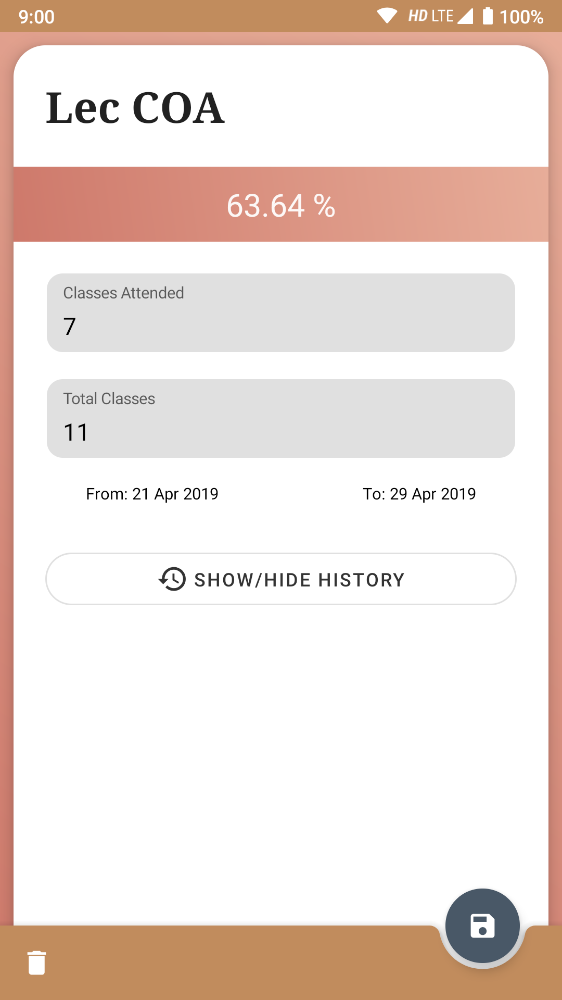

# Tardy

An app that can help track attendance.

## Features:

- offline
- displays the amount of classes that can be bunked
- displays the amount of classes that should be attended to reach the desired percentage

## Screenshots:

|||
|:-:|:-:|
 | 
 |  
| 
 |

## External Libraries Used:

- [butterknife](https://github.com/JakeWharton/butterknife)
- [material components android](https://github.com/material-components/material-components-android)
